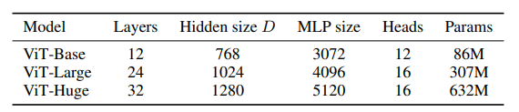
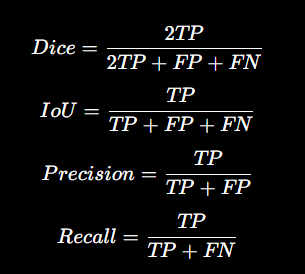

# sam-medical

## How to run evaluation

1. Follow the instructions in the official SAM repository to install dependencies and download the ViT checkpoints:
   https://github.com/facebookresearch/segment-anything

2. Download the dataset and place it inside the `data/` directory.

3. Run evaluation:

```bash
python eval.py
```

## ViT variance comparison



The ViT variance plot shows the variation in performance across different Vision Transformer (ViT) model configurations. This comparison helps analyze the effect of different SAM backbones on medical image segmentation performance.

## Segmentation evaluation metrics



The segmentation evaluation compares SAM performance using different prompt settings. The metrics shown include Dice score, IoU, Precision, and Recall. Higher values indicate better agreement between the predicted segmentation masks and the ground-truth masks.
